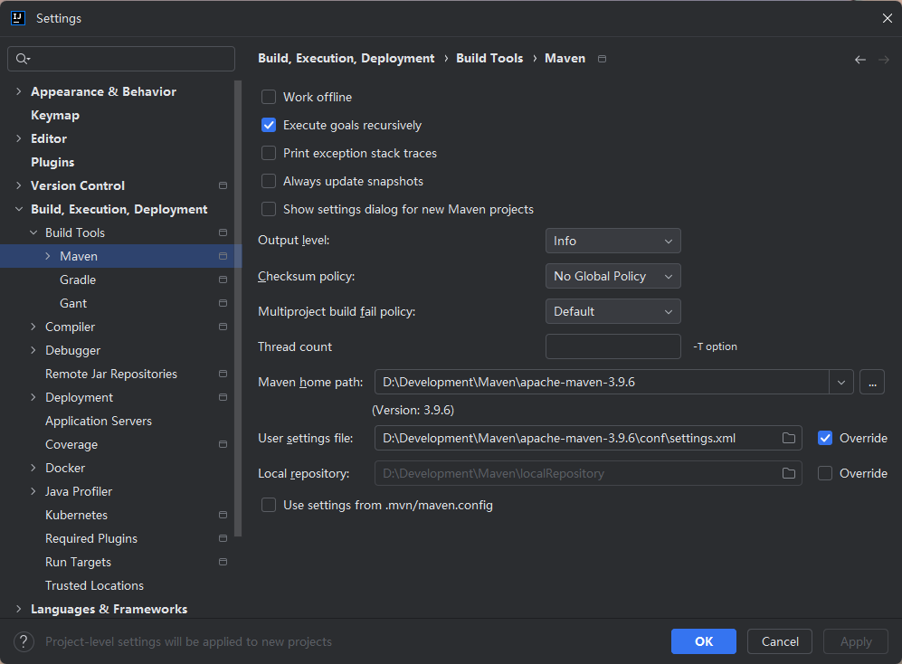
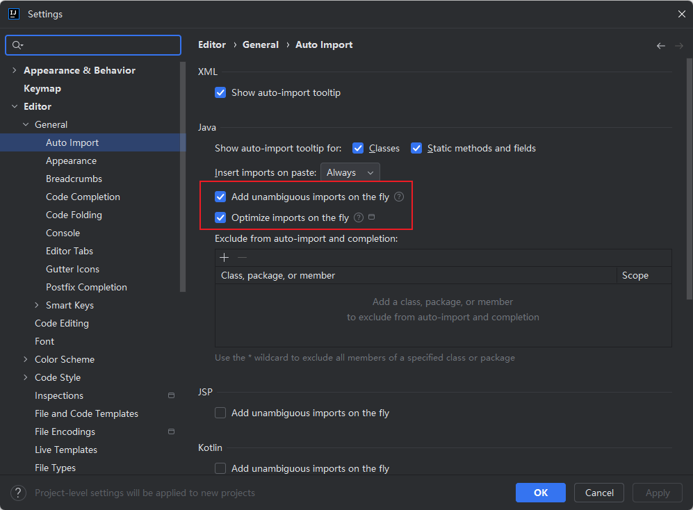
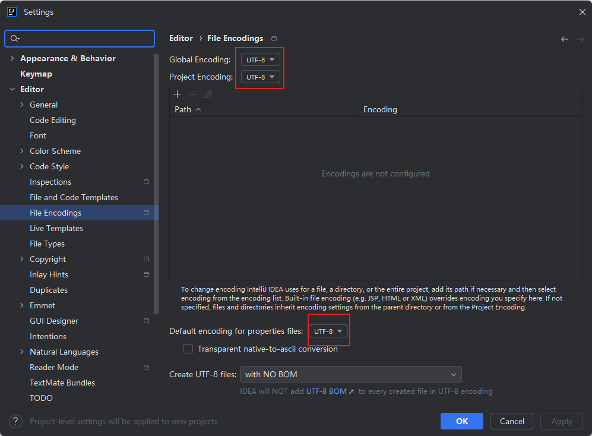
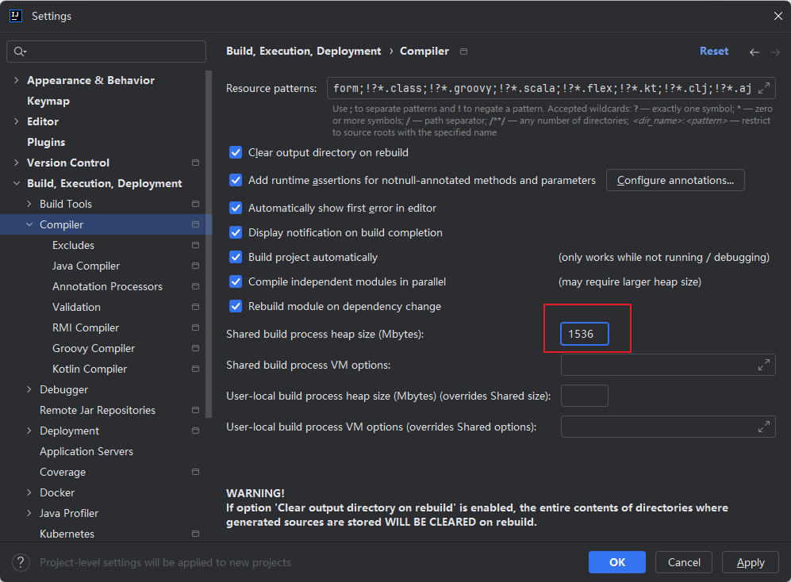

# All Settings

## Maven 配置

## 代码补全设置

## 自动导包

## 自动编译

## 多行显示

## 默认字符编码

## 自动添加头文件

## 隐藏 *.iml .idea 文件

## 取消自动折叠显示

## 调大默认的compile编译内存

## 取消竖线

## 取消小地球

## 取消小灯泡

## 启动时选择项目进入

## 注释前添加空格

## 统一编译器和编译版本

## 信任文件

## 开启事务注解

## 自动生成随机序列号

## 数据库 SQL Dialects

## 鼠标滚轮修改字体大小

# Plugins

- Alibaba Java Coding Guidelines

- Dracula Theme
- EasyCode
- Grep Console
- Maven Helper
- MyBatisX
- Translation
- Rainbow Brackets